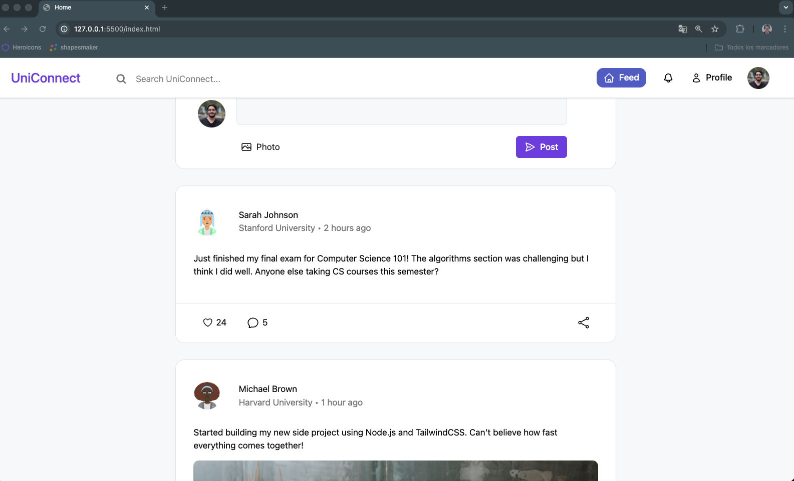
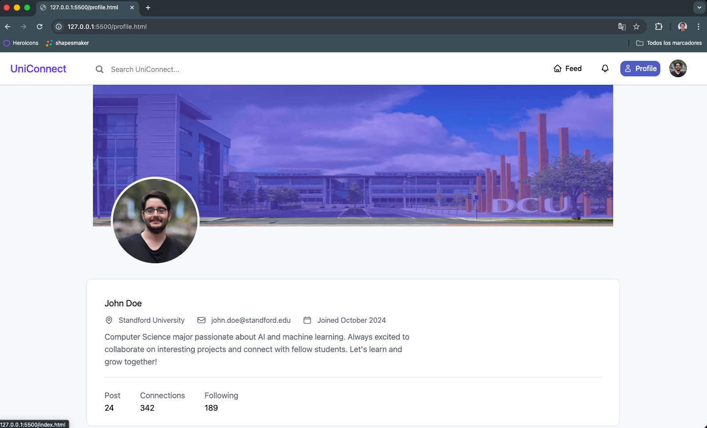

# 🌐 UniConnect

**UniConnect** is a modern and responsive web application designed to connect university students through a clean and intuitive interface.  
It includes a stylish login and registration system inspired by academic networks like LinkedIn or Notion, allowing students to access a shared digital space.

---

## Preview

---

## 🚀 Features
- ✨ Clean and minimal UI built with **TailwindCSS**
- 📱 Fully **responsive** design for all screen sizes
- 🔐 **Login and Register** form structure with modern placeholder and focus effects
- 🧱 Organized **HTML & CSS architecture** for scalability
- ⚙️ Easily expandable with backend or database integration

---

## 🛠️ Tech Stack
- **HTML5** – structure  
- **TailwindCSS** – styling and responsiveness  
- **JavaScript** *(optional)* – form logic or interactivity  
- **Node.js + Express** *(optional)* – backend setup for authentication  
- **SQL** *(future)* – user data management

---

## 🎯 Goals
- Apply **modern frontend principles** using TailwindCSS  
- Build a **responsive and accessible** layout  
- Design a **student-focused platform** with clean code and UI consistency  
- Demonstrate **practical web development skills** for academic assessment  

---

## 🧠 Future Improvements
- Add full **authentication system** (login/register with database)
- Create **student profiles** and connections
- Implement **dark mode**
- Integrate **real-time chat** or posts

---

## 👤 Author
**Alejandro Alonso**  
BSc (Hons) Computer Science — Robert Gordon University  
Aberdeen, Scotland 🇬🇧

pd : this guy also helped => 

---

