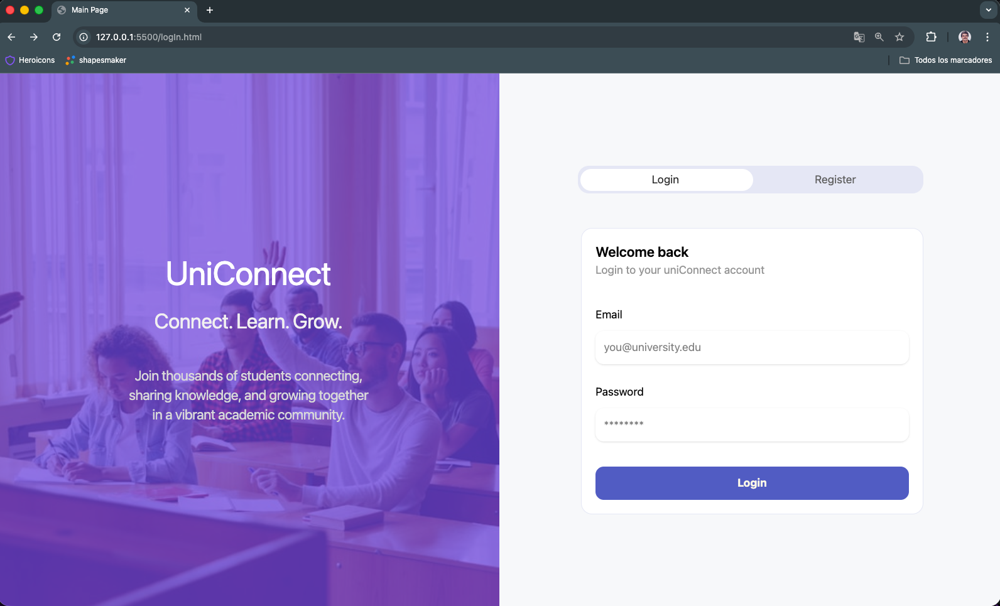
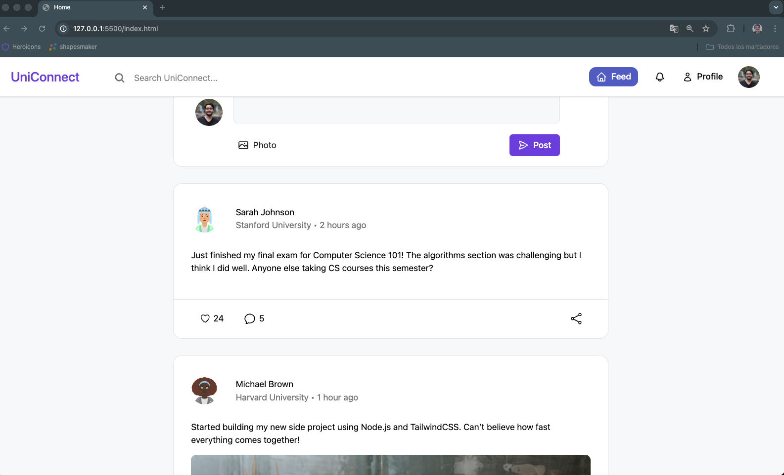
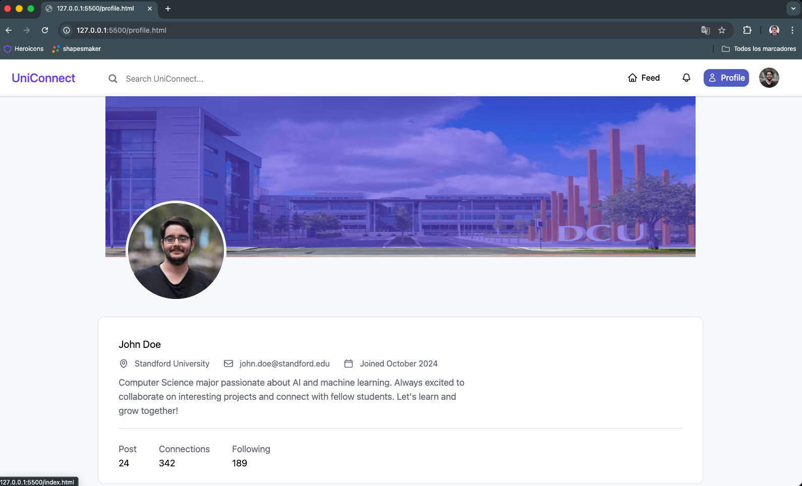
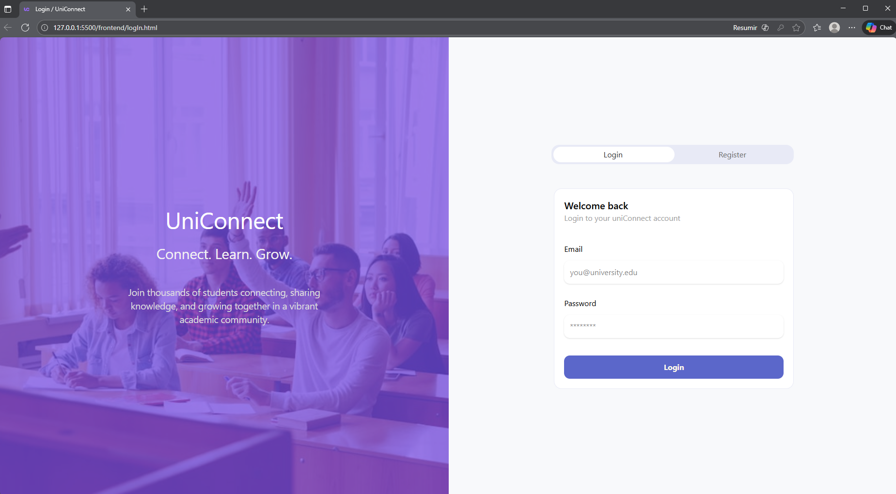
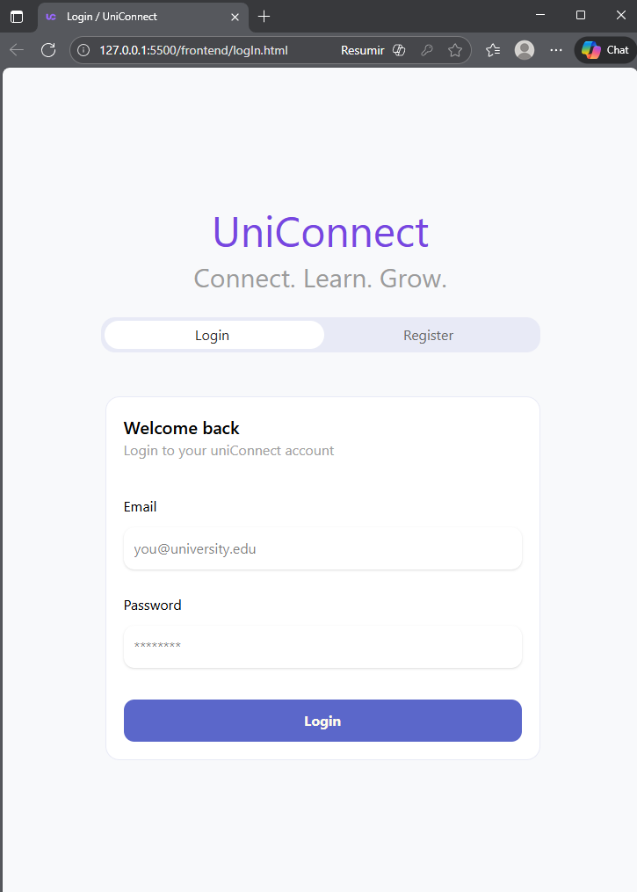
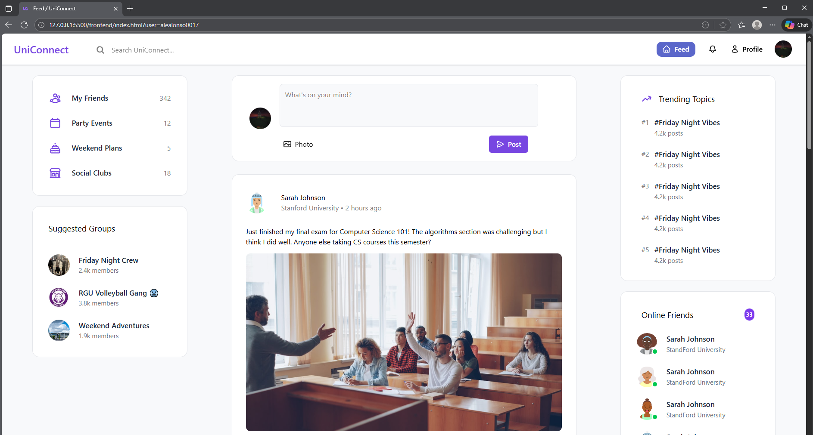
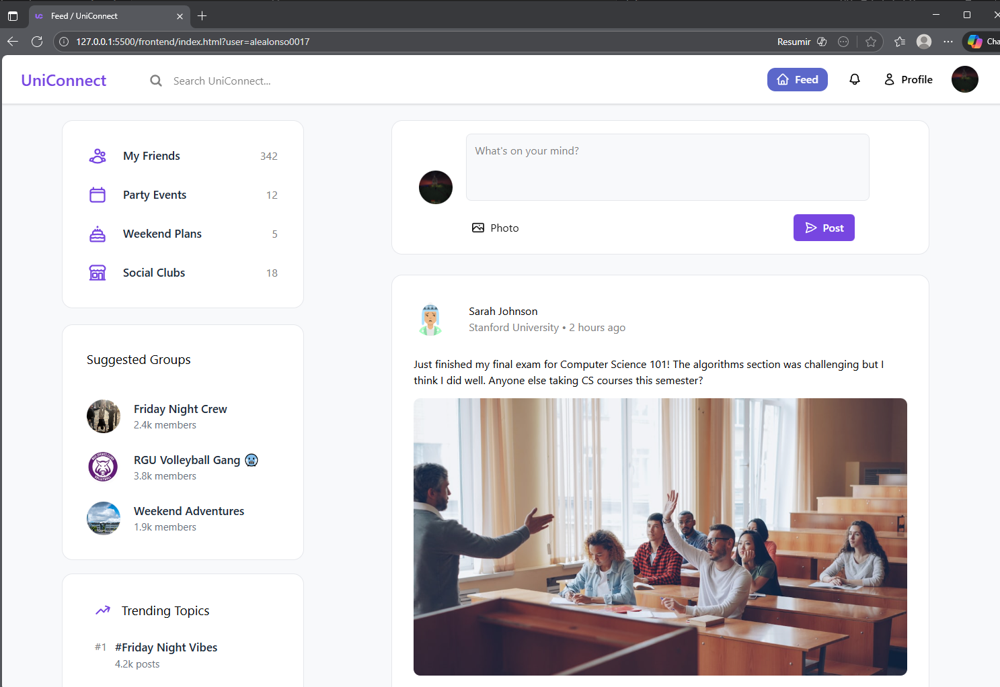

# 🌐 UniConnect

**UniConnect** is a modern and responsive full-stack web application designed to connect university students through a clean and intuitive interface.  
Built with a focus on **security, modularity, and scalability**, the platform allows students to register, post, and interact within a shared academic digital space — combining social networking dynamics with the professional tone of platforms like LinkedIn or Notion.

---

## 🖼️ Preview

  
  
  

---

## 🚀 Features
- ✨ Clean and minimal **UI** built with **TailwindCSS**
- 📱 Fully **responsive** grid-based layout for all screen sizes
- 🔐 **Secure authentication system** with encrypted passwords (bcrypt)
- ⏱️ **Session tokens (JWT)** for secure access with timed expiration
- 🧩 **Reusable frontend components** (headers, posts, panels, etc.)
- ⚙️ **Organized backend** using Node.js + Express + MySQL
- 🔄 **API endpoints** for registration, login, posts, and dynamic data fetching
- 🧱 Modular and **scalable architecture**, easy to expand with new features

---

## 🛠️ Tech Stack
### 🧩 Frontend
- **HTML5** — page structure  
- **TailwindCSS** — styling and responsiveness  
- **JavaScript (ES6 Modules)** — interactivity and reusable components  

### ⚙️ Backend
- **Node.js + Express.js** — server and API management  
- **MySQL** — relational database with foreign keys and constraints  
- **bcrypt** — secure password hashing  
- **JWT (JSON Web Token)** — authentication and token-based sessions  

---

📱 Responsive Design

UniConnect was built with a mobile-first, fully responsive layout, ensuring an optimal experience across phones, tablets, laptops, and large screens.
Using TailwindCSS responsive utilities, combined with CSS Grid and Flexbox, the interface adapts smoothly without breaking structure or readability.

✔️ What adapts automatically?

The login/register page becomes a single-column layout on smaller devices.
The 3-column feed reorganizes into a clean 1-column layout on mobile.
The header remains fixed (“sticky”) and adjusts icon spacing.
Post cards, images, and action buttons resize gracefully across breakpoints.
The profile page keeps content centered and easy to read on all screen sizes.

  
  
  
   

---
## 📐 Architecture Overview
- **/frontend** → UI views and Tailwind components  
- **/public/scripts** → Reusable JS classes (e.g., `LoadComponents.js`)  
- **/backend** → Express server, routes, authentication logic  
- **/db** → MySQL connection and schema  
- **/utils** → Security utilities (hashing, token validation, etc.)

---

## 🎯 Goals
- Implement **secure, real-world authentication** practices  
- Design a **scalable and readable** backend architecture  
- Maintain a **modern and intuitive** frontend using reusable design patterns  
- Encourage **community and collaboration** among university students  

---

## 🧠 Future Improvements
- 🌓 Add **dark mode** with user preferences  
- 💬 Real-time **messaging system** (WebSockets)   
- 🔍 Implement **advanced search** and filtering features  

---

## 👤 Author
**Alejandro Alonso**  
BSc (Hons) Computer Science — Robert Gordon University  
Aberdeen, Scotland 🇬🇧  

> 🧠 Passionate about **AI, Software Development, and scalable web systems**.  
> Dedicated to building reliable, maintainable, and creative digital solutions.

---

## 🎥 Credits
This project was initially built as a university assessment and evolved into a full personal project.  

pd: this guy also helped ↓  

---

